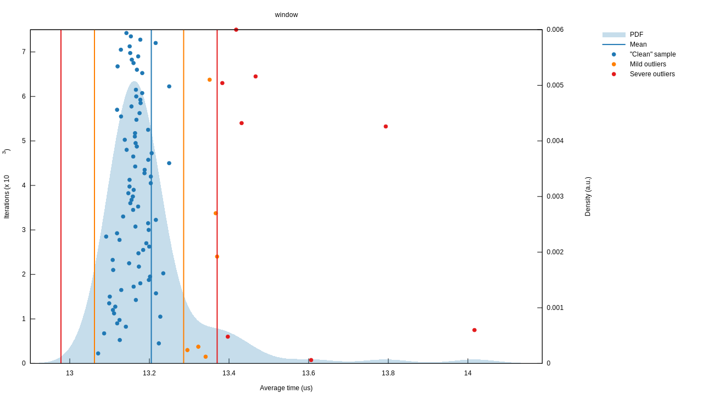
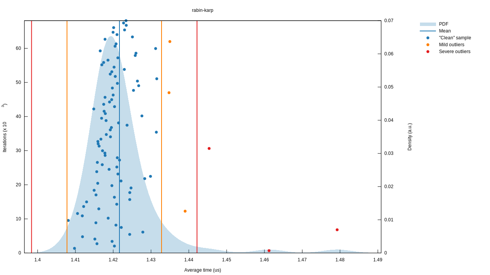
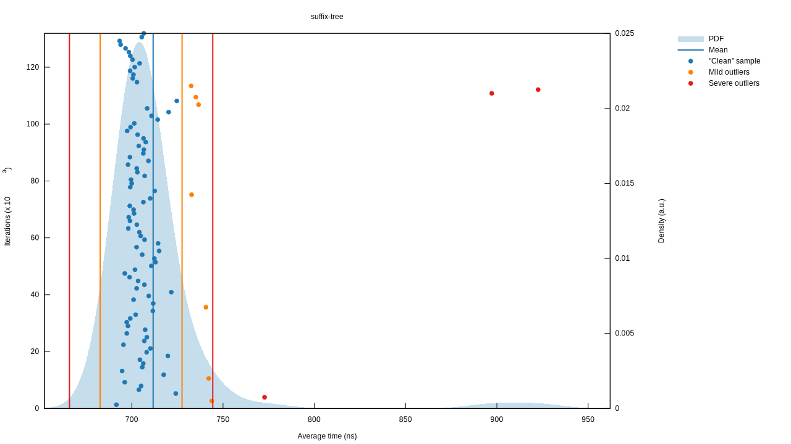
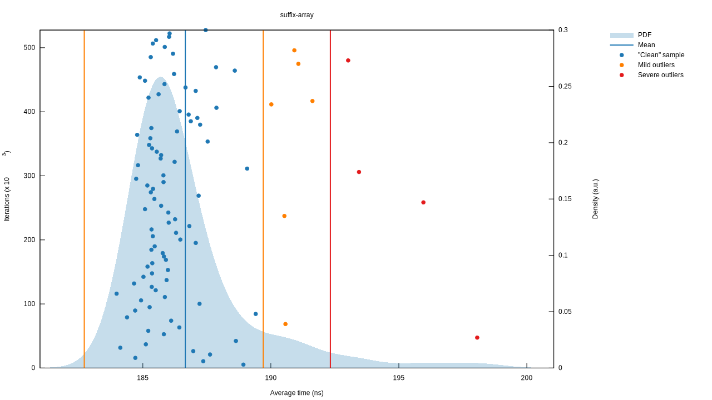

# Needle in a haystack

A haystack is a long string. A needle is a shorter string. Finding a needle in
the haystack is checking to see if a given needle (short string) is a substring
of the haystack (long string).

Example: the haystack `"banana"` _does_ contain the needle `"ana"` but _does
not_ contain the needle `"foo"`.

## Benchmark results

